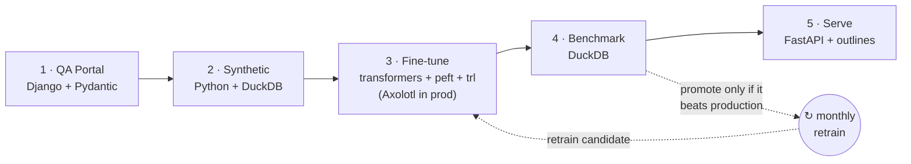

# freight-parser

**A self-hosted, fine-tuned open-source LLM that turns freetext freight
shipment confirmations into structured JSON — the entire pipeline, running on a
CPU laptop in a few minutes.**

Operations teams receive shipment confirmations as freetext chat and email from
carriers and freight partners. Every partner's format is different, and someone
re-keys each one by hand:

```
ACME FREIGHT                          conf: 3 skids @940lbs ea DAL to MEM
PU 12 pallets CHI -> LAX              del 03/14   $623.00 flat — BOL attached
Industrial adhesive  4,200 lb         acct 55219
rate 1,847.50 / load   fuel 120.00
REF PO-2024-8837   ETA 3/14
```

This repo is a clean-room reference implementation of a system that parses those
into a list of structured records — origin, destination, quantity, unit, weight,
partial dates, pickup/delivery leg, rate, accessorials, and a PO/BOL reference —
using a small **open-source model you fine-tune and host yourself**. No API keys,
no vendor lock-in, no data leaving your infrastructure. Just Python.

> This is an educational companion to a conference talk. **All data is
> synthetic**; there is no real client. The demo uses tiny models so it runs on a
> laptop — see [What's simplified vs. production](#whats-simplified-vs-production).

## Why self-host?

APIs are great — but sometimes they aren't an option:

- **Data sensitivity.** Shipment data is competitive. For some teams, "send it to
  a third-party API" is a non-starter. Full stop. Here, weights stay on your infra.
- **Control.** You can version the model, benchmark every candidate, and know
  exactly what changed between releases. A prompt tweak upstream can't silently
  regress you.
- **Cost at scale.** A fixed, self-hosted cost gets cheaper per document as volume
  grows into the thousands per day.

On a narrow extraction task like this, a small fine-tuned model can hold its own —
and you own it end to end.

## The pipeline

Five stages and one closed loop. Every box is open-source Python.



1. **QA portal** — get the *labels* right first. A Django + Pydantic review
   cockpit over the training data. Garbage in, garbage out: 3,000 trusted rows
   beat 30,000 noisy ones.
2. **Synthetic data** — stretch a small labeled set across the long tail. Build
   the JSON first, then render messy text *from* it, so the label can't be wrong.
3. **Fine-tune** — LoRA-fine-tune an older and a newer small model on identical
   data (train 1% of the weights, keep 100% of the model).
4. **Benchmark** — score every prediction into one debuggable category and let a
   single DuckDB query gate the release.
5. **Serve** — FastAPI + constrained decoding, so the output is *always* valid
   JSON. Plus a browser playground you can demo live.

The monthly retrain loop pulls newly-reviewed examples, retrains a candidate, and
promotes it **only if it beats the incumbent on the benchmark**. A bad retrain
never ships.

## Quickstart

Requires [`uv`](https://docs.astral.sh/uv/) and nothing else (it manages Python
3.11 for you).

```bash
uv sync           # create the venv + install the whole workspace
make demo         # run the entire pipeline end to end, then serve the playground
```

`make demo` runs in a few minutes on a CPU laptop (the first run also downloads
~2 GB of tiny open models from Hugging Face; after that it's fully offline-capable
— see [Offline](#offline)). It:

1. migrates + seeds the QA portal and auto-marks the seed set reviewed,
2. generates synthetic confirmations into DuckDB and exports them,
3. prepares an alpaca training set (real + synthetic) with a held-out benchmark,
4. LoRA-fine-tunes **both** the older and newer models,
5. benchmarks both and prints the per-category breakdown + the older-vs-newer
   comparison table,
6. boots the serving API, parses one example with each model to show the
   difference, and leaves the **playground running at http://localhost:8000/**.

### Running each stage on its own

```bash
make qa           # launch the Django QA review portal (http://localhost:8000/)
make synth        # generate synthetic data into DuckDB and export it
make train-all    # LoRA-fine-tune the older and newer models
make train MODEL=lightweight   # or fine-tune a single registered model
make eval         # benchmark the trained models and print the comparison table
make serve        # boot the FastAPI serving API + playground
make retrain      # closed-loop retrain with the benchmark gate
make test         # run every package's pytest suite
make fmt          # format + autofix with ruff
make clean        # remove generated artifacts (adapters, DBs, datasets)
```

Prefer raw commands? Every target is a thin wrapper over `uv run …` — run
`make help` to see them.

### The QA portal

```bash
uv run python packages/qa_portal/manage.py migrate
uv run python packages/qa_portal/manage.py seed        # loads data/seed + injects label errors
uv run python packages/qa_portal/manage.py runserver   # open http://localhost:8000/
```

The Django admin is the review cockpit: filter by reviewed/corrected/excluded,
search the raw text, fix the JSON (never the source text), and use **Save & next**
to mark a record reviewed and jump to the next one. Any JSON you enter is
validated against the shared Pydantic schema.

### The playground

`make serve`, then open **http://localhost:8000/**. Paste a confirmation, pick a
model from the dropdown (flip **older ↔ newer** live), optionally type a
plain-English hint in the **Guidance** box (e.g. *"there are 3 shipments in this
message"*), and hit **Parse**. The JSON that comes back is always schema-valid;
guidance steers the *content* (like how many line items), never the shape.

```bash
# parse a confirmation (default model)
curl -s localhost:8000/parse -H 'content-type: application/json' \
  -d '{"text":"PU 12 pallets CHI -> LAX rate 1,847.50"}' | python -m json.tool

# with a natural-language guidance hint
curl -s localhost:8000/parse -H 'content-type: application/json' \
  -d '{"text":"Leg 1: PU 20 pallets CHI to ATL 1500.00\nLeg 2: DLV 10 skids ATL to DFW 800.00\nLeg 3: PU 5 cartons DFW to LAX 300.00",
       "guidance":"there are 3 shipments in this message"}' | python -m json.tool

# choose a model explicitly, and list what's available
curl -s localhost:8000/parse -d '{"text":"del 3 skids DAL to MEM $623.00","model":"older"}' -H 'content-type: application/json'
curl -s localhost:8000/models | python -m json.tool
```

## Architecture

One Pydantic schema is the source of truth, imported everywhere — the QA portal,
the synthetic generator, the trainer's dataset prep, the evaluator, and the
serving API all use the *same* `ShipmentLine` definition and the *same* prompt
(`build_prompt`). Change a field in one place and the whole pipeline follows.

| Stage | Package | Libraries |
|-------|---------|-----------|
| Shared schema | `packages/schema` (`freight_schema`) | Pydantic v2 |
| 1 · QA portal | `packages/qa_portal` | Django + Pydantic, SQLite |
| 2 · Synthetic data | `packages/synthetic` | Python + DuckDB, Typer |
| 3 · Fine-tune | `packages/finetune` | transformers + peft + trl (Axolotl for GPU/prod) |
| 4 · Benchmark | `packages/eval` | DuckDB |
| 5 · Serve + playground | `packages/serving` | FastAPI + outlines, vanilla-JS UI |

### The switchable models

The registry (`packages/finetune/models.toml`) ships three tiny open models `make
demo` uses on a laptop, plus a `production` slot used only on the GPU path; any id
is overridable via `FREIGHT_MODEL_<NAME>` env vars.

| Name | Base model | Generation | Role |
|------|-----------|-----------|------|
| `older` | `Qwen/Qwen2-0.5B-Instruct` | prior gen | baseline |
| `newer` ✓ | `Qwen/Qwen2.5-0.5B-Instruct` | current gen | **laptop default** |
| `lightweight` | `HuggingFaceTB/SmolLM2-360M-Instruct` | current gen | lightest/fastest |
| `production` | `Qwen/Qwen2.5-7B-Instruct` | current gen | 8B-class tier — GPU only (see below) |

Same size, same data, two generations: the benchmark makes the "newer base wins
for free" story visible. The `production` slot is untrained/inert on a laptop
(`make demo` never touches it); on a GPU it's the headline 8B — see
[docs/RUNNING_ON_GPU.md](docs/RUNNING_ON_GPU.md).

### Valid JSON by construction

Serving uses [`outlines`](https://github.com/dottxt-ai/outlines) constrained
decoding against the schema, so **malformed JSON never reaches a caller** —
temperature 0 for determinism. A couple of production touches are baked in:

- **Reference guard.** If the model emits a PO/BOL reference that isn't a literal
  substring of the input text, it's nulled out — no hallucinated identifiers.
- **Exact numeric matching.** Rates and weights are `Decimal` end to end; a JSON
  number token round-trips into an exact `Decimal`, never through a lossy float.

### The benchmark gate

Every prediction is scored into exactly one category, in a fixed precedence:
`ERROR › CORRECT › UNORDERED › EXTRA_ITEMS › MISSING_ITEMS › BAD_QUANTITY ›
BAD_REFERENCE › BAD_DATE › BAD_WEIGHT › BAD_UNIT › BAD_LEG › BAD_RATE › OTHER`.
`CORRECT` and `UNORDERED` count as accurate; everything else points at the field
that broke. One DuckDB query ranks the models and decides what ships:

```sql
SELECT model_name, version,
       100 * avg((category = 'CORRECT')::INT)::FLOAT AS pct_correct,
       100 * avg(field_accuracy)::FLOAT            AS pct_fields,
       avg(duration)::DECIMAL(10,2)                AS avg_seconds
FROM read_json('data/predictions/*.jsonl')
GROUP BY model_name, version
ORDER BY pct_correct DESC, pct_fields DESC;
```

Exact-match `% correct` is the gate. On this laptop-scale demo it's a *harsh* bar
for a 0.5B model — a single wrong field (a mis-parsed date, a reference the model
couldn't copy verbatim) sinks the whole record — so the headline numbers are low
and are **illustrative only**. The finer **field-level accuracy** is what reveals
the newer base pulling ahead, exactly the "one number hides where it fails" point
from the talk. Production runs an 8B-class model where exact-match is high.

## Offline

The only network access is the first-run model download from Hugging Face. After
that, point the cache at the repo and go fully offline:

```bash
export HF_HOME=./.hf_cache        # cache weights inside the checkout
make demo                          # first run downloads + caches
export HF_HUB_OFFLINE=1 TRANSFORMERS_OFFLINE=1   # subsequent runs need no network
```

On Linux you may want the CPU-only PyTorch wheels:
`uv sync --extra-index-url https://download.pytorch.org/whl/cpu` (macOS ships CPU
builds by default).

## What's simplified vs. production

Every substitution is deliberate and honest — the *shape* of the production
system, scaled to a laptop:

| Production | This demo |
|-----------|-----------|
| An 8B-class instruct model | A 0.5B model (`make demo` trains two) |
| Axolotl LoRA/QLoRA on a GPU (`configs/lora.yaml`, `configs/qlora.yaml`) | TRL + PEFT, fp32 on CPU |
| LoRA on all attention + MLP projections, several epochs | LoRA on `q_proj,v_proj`, ~2 epochs, a few hundred rows |
| A cloud data warehouse | A local DuckDB file |
| A GPU serving engine with logit-processor constrained decoding | `outlines` + `transformers` on CPU (same constrained-decoding idea) |
| A managed database | SQLite |
| Thousands of real, reviewed labels | ~60 hand-written seed rows + synthetic |

The Axolotl configs and `packages/finetune/quantize.md` (merge-then-quantize for
deployment) document the GPU/production path; Axolotl is intentionally **not** in
the default dependencies, and none of it runs in `make demo`. To actually run the
pipeline with a production-tier 8B model on a GPU — same schema, same playground,
the talk's accuracy — follow [docs/RUNNING_ON_GPU.md](docs/RUNNING_ON_GPU.md).

## Repo layout

```
freight-parser/
├── Makefile                     # demo, qa, synth, train, eval, serve, retrain, test, ...
├── pyproject.toml               # uv workspace root (Python 3.11)
├── packages/
│   ├── schema/                  # freight_schema: the one Pydantic schema + prompt
│   ├── qa_portal/               # Django review cockpit (SQLite)
│   ├── synthetic/               # generator + DuckDB store + Typer CLI
│   ├── finetune/                # dataset prep, LoRA trainer, model registry, Axolotl configs
│   ├── eval/                    # predict + score + DuckDB release gate
│   └── serving/                 # FastAPI + outlines + playground UI + Dockerfile
├── data/
│   ├── seed/confirmations.jsonl # ~60 hand-written confirmations + gold JSON
│   └── README.md                # data formats + the 4-category label-error taxonomy
├── scripts/
│   ├── demo.py                  # the `make demo` orchestrator
│   └── retrain.py               # closed-loop retrain with the benchmark gate
└── .github/workflows/retrain.yml  # illustrative monthly retrain (CPU)
```

## License

MIT — see [LICENSE](LICENSE). A clean-room educational reference; all data is
synthetic.
